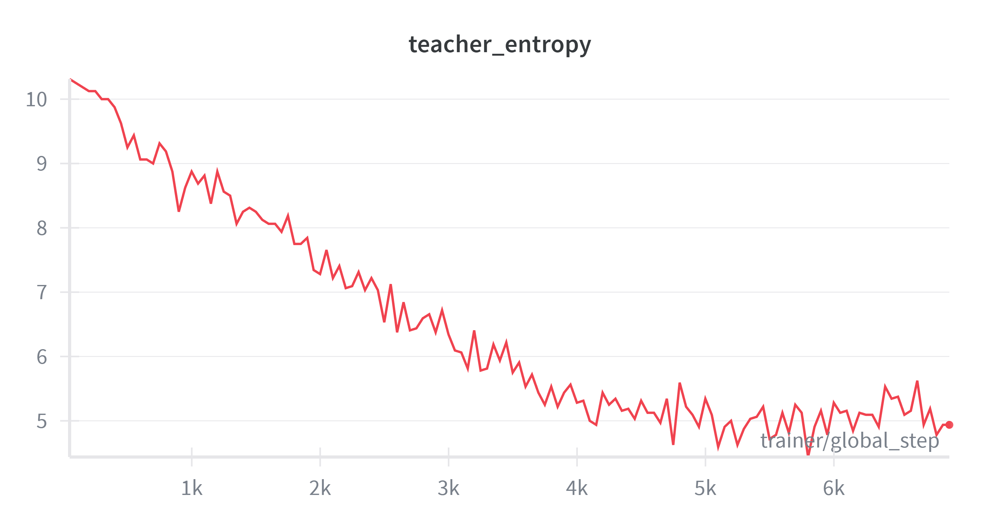
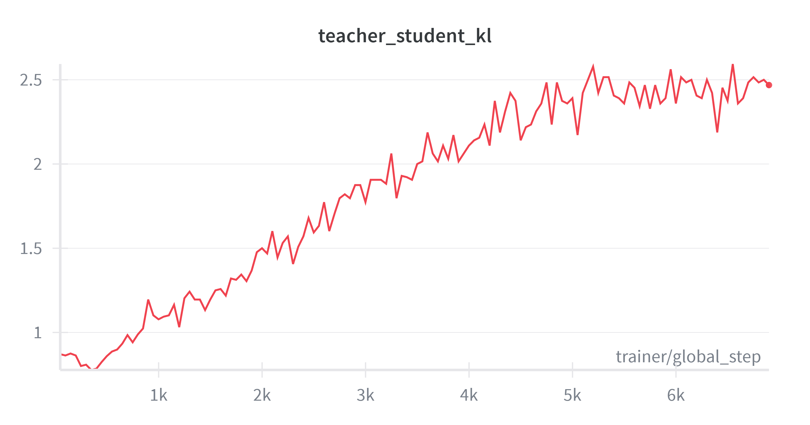
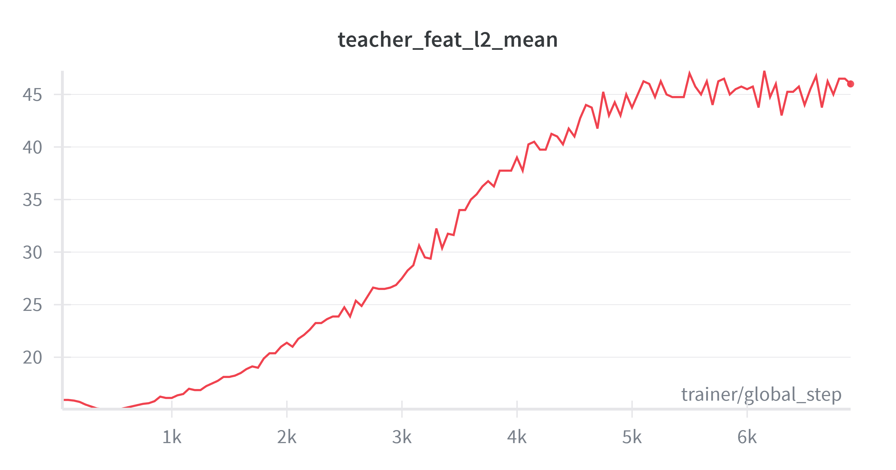
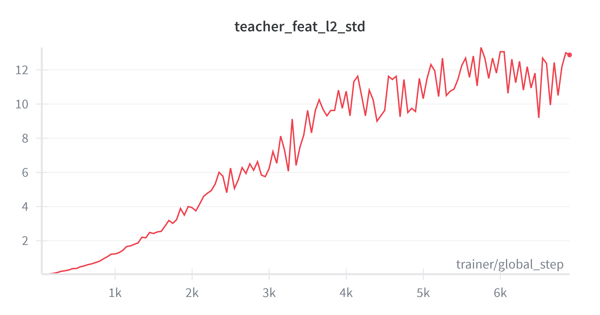
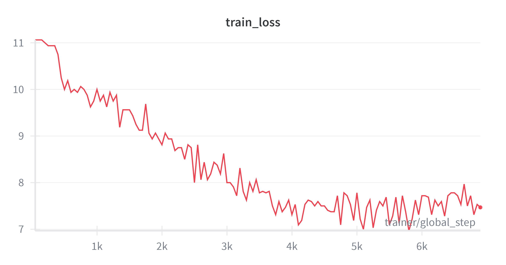
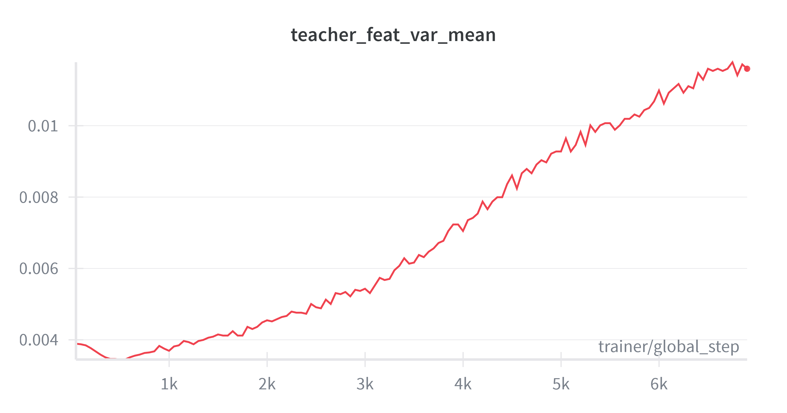
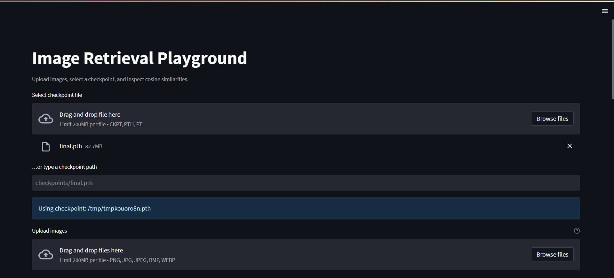
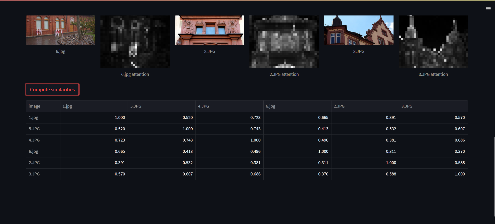
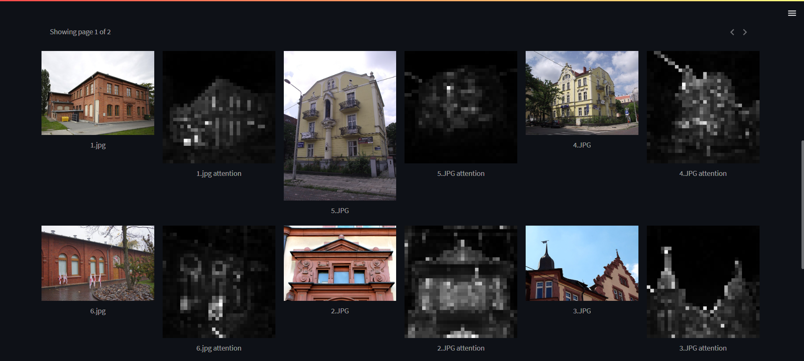

# Description

This repo contains code for training a deep learning model for image retrieval on [Google Landmark Dataset v2](https://github.com/cvdfoundation/google-landmark). I tried to replicate the original DINO paper [1] using Vision Transformer (ViT) as backbone and tested it on revised Oxford-5k and Paris-6k datasets [2].

[1] M. Caron et al., “Emerging Properties in Self-Supervised Vision Transformers,” May 24, 2021, arXiv: arXiv:2104.14294. doi: 10.48550/arXiv.2104.14294.

[2] F. Radenović, A. Iscen, G. Tolias, Y. Avrithis, and O. Chum, “Revisiting Oxford and Paris: Large-Scale Image Retrieval Benchmarking,” Mar. 29, 2018, arXiv: arXiv:1803.11285. doi: 10.48550/arXiv.1803.11285.

## Dataset

The Google Landmark Dataset v2 contains around 5 million images of various landmarks around the world, categorized into over 200,000 classes. The dataset is designed for training and evaluating image retrieval systems. 

To train my model quickly, I've used a subset of the dataset containing approximately 762,000 images containing 101,000 landmarks.

To test my model, I've used the revised Oxford-5k and Paris-6k datasets, which are standard benchmarks for image retrieval tasks. They contain 5000 and 6000 images, respectively, with 70 query images for Oxford-5k and 55 query images for Paris-6k. Both datasets define three evaluation setups: Easy, Medium, and Hard, based on the difficulty of the queries.

## Description of the Problem

The problem I was trying to solve is image retrieval, which involves finding images in a large database that are similar to a given query image. A deep learning model is trained to learn feature representations of images such that similar images have similar feature vectors. During retrieval, the feature vector of the query image is compared to the feature vectors of all images in the database using the cosine similarity, and the most similar images are returned as results.

## Model Architecture

The model architecture I chose is a simple Vision Transformer backbone (ViT small) followed by a projection head (a MLP). The ViT backbone operates on patches of size 16x16 pixels and outputs a feature vector of size 384. The projection head consists of three linear layers with GELU activations in between, mapping the 384-dimensional feature vector to a 65536-dimensional output. The projection head is only used during training and is removed during inference.


The model is trained in a self-supervised manner, following the DINO (self-**di**stillation with **no** labels) approach. In this setup, two identical networks (student and teacher) are used. The table below summarizes the architecture of both networks:

```
  | Name    | Type      | Params | Mode  | FLOPs
------------------------------------------------------
0 | student | BaseModel | 44.0 M | train | 0    
1 | teacher | BaseModel | 44.0 M | train | 0    
------------------------------------------------------
44.0 M    Trainable params
44.0 M    Non-trainable params
88.0 M    Total params
176.071   Total estimated model params size (MB)
```

## Training

To run the training, use the following command:

```bash
uv run -m src.train
```

The training process closely follows the original DINO training procedure. The student model is trained using the cross entropy loss between it's projection head output and the teacher's projection head output. Both outputs are first normalized using temperature softmax, and the teacher's output is also centered using a running average of previous outputs to prevent collapse. The teacher model's weights are updated using an exponential moving average of the student model's weights.

The student model is trained using the AdamW optimizer, where both the learning rate and weight decay follow a cosine schedule with warmup. The teacher's temperature also follows a schedule, starting from a warmup value and gradually increasing to a final value.

One of the most important part of the training setup are the random augmentations. The original DINO paper used two random views of the image: global crops and local crops. Global crops are large random crops of the image (covering 25-100% of the image) while local crops are smaller random crops (covering 5-25% of the image). The teacher always receives only 2 global crops, while the student receives both the 2 global crops and several local crops (10 in my case). All the crops are normalized using mean and std values of the Google Landmark Dataset v2, and multiple random augmentations are applied to each crop, including random horizontal flips, color jitter, grayscale conversion, Gaussian blur, and solarization. 

# Results

## Metrics

I used the following metrics to evaluate the performance of my image retrieval model on the revised Oxford-5k and Paris-6k datasets:

- Mean Average Precision (mAP)
- Mean Precision at 10 (mP@10)
- R-Precision
- F1 measure

Here are the results on both datasets for easy, medium, and hard setups on the Oxford-5k dataset:

| Setting | mAP | mP@10 | R-Precision | F1 measure |
|---------|-----|-------|-------------|------------|
| Easy    | 0.5230 | 0.4838 | 0.4935 | 0.2678 |
| Medium  | 0.3800 | 0.5300 | 0.3633 | 0.2043 | 
| Hard    | 0.1382 | 0.1943 | 0.1350 | 0.0903 |

and Paris-6k dataset:

| Setting | mAP | mP@10 | R-Precision | F1 measure |
|---------|-----|-------|-------------|------------|
| Easy    | 0.7906 | 0.9114 | 0.7273 | 0.2301 |
| Medium  | 0.6204 | 0.9586 | 0.5811 | 0.0998 | 
| Hard    | 0.3421 | 0.5957 | 0.3614 | 0.1105 |

## Traning plots

During training I logged the following metrics:
1. The cross entropy loss
2. The entorpy of the teacher's output distribution
3. The KL divergence between the student and teacher output distributions
4. The mean variance of the teacher's output across the batch
5. The mean L2 norm of the teacher's output across the batch
6. The std of the L2 norm of the teacher's output across the batch

The metrics 2 and 3 are meant to monitor the collapse, i.e. when the model starts outputting the same feature vector for all images. The metrics 4, 5, and 6 are meant to monitor the stability of the teacher's output.

Here are some training plots:

<table>
  <tr>
    <td></td>
    <td></td>
    <td></td>
  </tr>
  <tr>
    <td></td>
    <td></td>
    <td></td>
  </tr>
</table>

# Streamlit app

I've also created a simple Streamlit app for image retrieval using my trained model. The app allows users to upload images and showcases a similarity matrix calculated using my model's feature vectors. Additionally, it provides explanations for predictions made by the model.

The main page:

The similarity matrix:

The explanations of the results (attention maps):


# Setup

## Hyperparameters

Some important hyperparameters used during training are:
- Batch size: 128 * 8 GPUs = 1024. This value was chosen, since in the orignal's paper ablation study this value gave the best results.
- Learning rate: 0.00001 - 0.0005. Copied from the original paper for batch size 1024.
- Teacher's temperature: 0.03 to 0.04. During the initial experiments my model was not learning at all, so following some recommendations from the DINO GitHub issues, I decreased the teacher's warmup temperature from 0.04 to 0.03.
- Weight decay: 0.04 to 0.4. Copied from the original paper.
- Number of epochs: 10. Due to limited computational resources, I was only able to train the model for 10 epochs, while the original paper trained for 100 epochs.
- The number of local crops: 10. Copied from the original paper.

## Runtime environment

I trained my model using 8 NVIDIA RTX 4090 GPUs with 24GB of VRAM each. The training time for 10 epochs was approximately 4 hours. The inference time took around 5-10 minutes (since I didn't use distributed inference).


# Completed items

This project was done as a part of Computer Vision course at PUT. I have completed the following items from the project specification:

| Item | Points | Description |
|------|--------|-------------|
| Problem: Search Engine | +2 | |
| Model | +1 | I used a ready-made architecture and trained it from scratch. |
| Non-trivial solution in the architecture | +1 | I used DINO self-supervised training approach, which combines self-distillation and momentum encoder techniques. |
| Evaluation on at least 10k samples | +1 | I evaluated my model on the revised Oxford-5k and Paris-6k datasets, which contain more than 10k images in total. |
| Data augmentation | +1 | Data augmentations are necessary for DINO training. I described them in the README. |
| Distributed training | +1 | I used 8 GPUs for training. |
| W&B | +1 | I logged training metrics using W&B. |
| Streamlit | +1 | I created a simple Streamlit app for image retrieval using my trained model. |
| DVC | +2 | I used DVC to version control my dataset and benchmarks. |
| Explanations of 3 at least predictions | +2 | The explanations are provided in the Streamlit app, and the screenshots are included in the README. |
